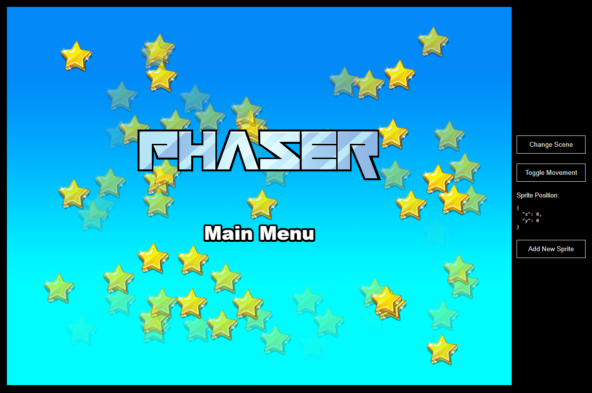

# This Song is Mine

A unique puzzle-platformer game where rhythm meets Mario-style gameplay. Control your character through challenging levels by creating drum loops that guide your journey. Every beat matters in this innovative musical platformer adventure.



## 🎮 Gameplay

**This Song is Mine** combines classic platformer mechanics with rhythm-based puzzle solving:

-   **Platformer Action**: Navigate through Mario-style levels with jumping, running, and collision mechanics
-   **Musical Integration**: Create drum sequences using a built-in drum sequencer
-   **Puzzle Elements**: Your drum loop affects how you progress through each level
-   **Responsive Design**: The game adapts to different screen sizes while maintaining gameplay integrity

## 🛠️ Technical Stack

This game is built using modern web technologies:

-   **[Vue.js 3.5.13](https://vuejs.org/)** - Frontend framework for UI components and state management
-   **[Phaser.js 3.90.0](https://phaser.io/)** - Game engine for 2D graphics, physics, and game mechanics
-   **[Vite 6.3.1](https://vitejs.dev/)** - Build tool and development server
-   **Web Audio API** - Real-time audio synthesis for the drum sequencer

### Unique Technical Features

**Bottom-Left Coordinate System**: Unlike Phaser's default top-left coordinate origin, this game implements a bottom-left coordinate system to ensure responsive gameplay across different screen sizes. This approach allows for:

-   Consistent ground positioning regardless of screen height
-   Intuitive level design where platforms are positioned from the bottom up
-   Better responsive behavior when the game window is resized

```javascript
// Example: Positioning floor at bottom of screen
const floorY = gameHeight - this.blockSize / 2;

// Example: Platform positioning from bottom-left
this.platforms.create(
    this.blockSize * 3 + this.blockOffset,
    gameHeight - this.blockSize * 3 - this.blockOffset,
    "dirt_block"
);
```

## 🚀 Getting Started

### Prerequisites

-   [Node.js](https://nodejs.org) (version 16 or higher)
-   npm (comes with Node.js)

### Installation

1. Clone the repository
2. Install dependencies:

    ```bash
    npm install
    ```

3. Start the development server:

    ```bash
    npm run dev
    ```

4. Open your browser and navigate to `http://localhost:8080`

### Available Commands

| Command               | Description                                 |
| --------------------- | ------------------------------------------- |
| `npm install`         | Install project dependencies                |
| `npm run dev`         | Launch development server with logging      |
| `npm run build`       | Create production build                     |
| `npm run dev-nolog`   | Launch development server without analytics |
| `npm run build-nolog` | Create production build without analytics   |

## 🏗️ Project Structure

```
src/
├── App.vue              # Main Vue application component
├── main.js              # Vue application entry point
├── PhaserGame.vue       # Phaser-Vue bridge component
├── DrumSequencer.vue    # Musical interface component
└── game/
    ├── main.js          # Phaser game configuration
    ├── EventBus.js      # Vue-Phaser communication
    ├── debug.js         # Development debug tools
    └── scenes/
        ├── Game.js      # Main game scene
        └── Preloader.js # Asset loading scene

public/
├── assets/
│   └── Sprites/         # Game sprite assets
│       ├── Characters/  # Player character sprites
│       ├── Enemies/     # Enemy sprites
│       ├── Tiles/       # Level tile sprites
│       └── Backgrounds/ # Background sprites
└── style.css           # Global styles
```

## 🎵 Drum Sequencer Features

The integrated drum sequencer includes:

-   **4 Drum Tracks**: Kick, Snare, Hi-Hat, and Open Hat
-   **16-Step Sequencer**: Create complex rhythmic patterns
-   **Real-time Audio**: Web Audio API synthesis for immediate feedback
-   **Visual Feedback**: Color-coded tracks and step highlighting
-   **BPM Control**: Adjustable tempo to match your gameplay style

## 🎯 Game Features

### Character System

-   Multiple character sprites with walk, jump, and idle animations
-   Responsive physics with gravity and collision detection
-   Smooth movement controls optimized for rhythm-based gameplay

### Level Design

-   Grid-based level construction for precise platforming
-   Responsive positioning using bottom-left coordinate system
-   Debug tools for development and level creation

### Physics & Mechanics

-   Arcade physics with customizable gravity and drag
-   Collision detection between player and platforms
-   World bounds to keep gameplay contained

## 🔧 Development

### Vue-Phaser Integration

Communication between Vue components and Phaser scenes is handled through an EventBus:

```javascript
// In Vue components
import { EventBus } from "./game/EventBus";
EventBus.emit("event-name", data);

// In Phaser scenes
EventBus.on("event-name", (data) => {
    // Handle the event
});
```

### Debug Tools

Development includes comprehensive debug utilities:

-   Grid overlay with coordinate visualization
-   Collision zone display
-   Performance monitoring
-   Responsive dimension testing

### Asset Management

Game assets are organized by type and include multiple resolution versions:

-   `Default/` - Standard resolution sprites
-   `Double/` - High-resolution variants for modern displays

## 📱 Responsive Design

The game automatically adapts to different screen sizes:

-   **Split Layout**: Game takes the top 50% of screen, drum sequencer takes the bottom 50%
-   **Dynamic Scaling**: Game dimensions adjust to viewport while maintaining aspect ratio
-   **Minimum Sizes**: Enforced minimum dimensions ensure playability on small screens
-   **Bottom-Left Origin**: Custom coordinate system ensures consistent ground positioning

## 🚀 Building for Production

Create a production build:

```bash
npm run build
```

The built files will be in the `dist/` folder. Deploy all contents to your web server.

## 📄 License

MIT License - See [LICENSE](LICENSE) file for details.

---

_Powered by Vue.js, Phaser.js, and the magic of combining rhythm with platforming gameplay._
